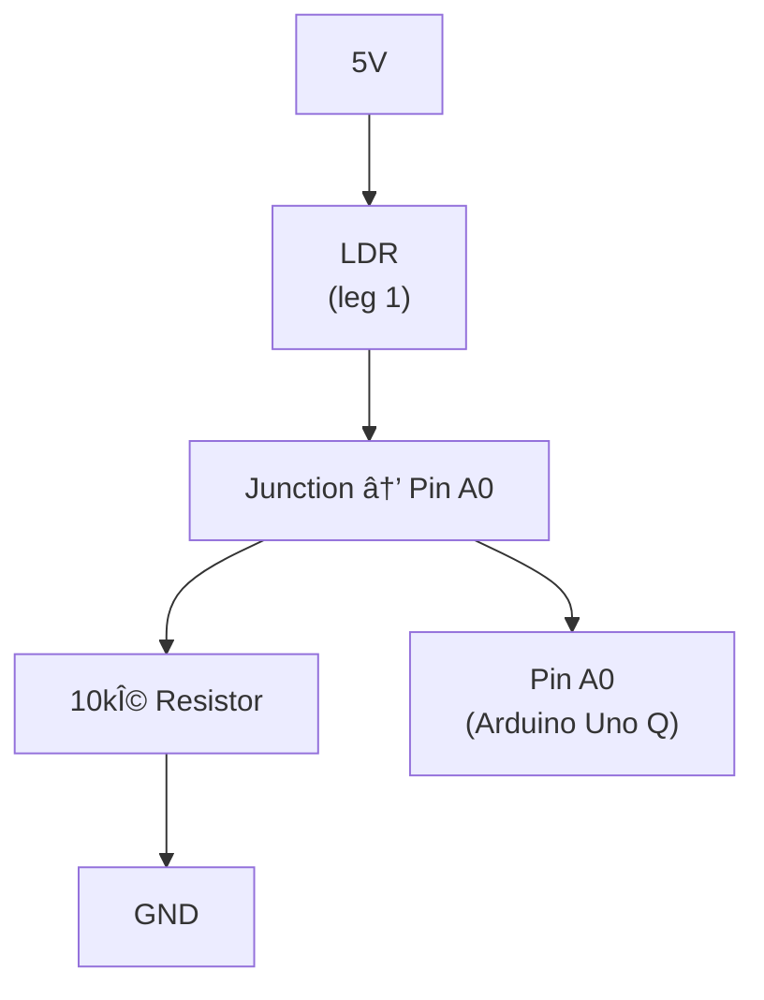

> **Session:** 2B — Lab: Light Sensor Circuit
> **Duration:** 45 minutes
> **Team:** ___________ Creation Station #_______
> **Prerequisites:** Session 2A (How Devices Sense the World) lecture completed

---

## Safety

> **SAFETY:** All components in this lab operate at 5V DC from the Arduino Uno Q. These voltages are safe to touch. However, never short 5V directly to GND with a wire — this can damage the board's voltage regulator. Always verify your wiring before connecting power.

---

## Objective

Build a light-sensing circuit using an LDR (light-dependent resistor) in a voltage divider configuration. Read the analog values through the Arduino's ADC and verify the readings change with light levels. Then use the sensor reading to control an LED's brightness.

---

## Parts List

| Part | Qty | How to Identify |
| :--- | :--- | :--- |
| 2004 I2C LCD display | 1 | Already connected at your station (20×4 character display) |
| LDR (light-dependent resistor) | 1 | Two-legged component with serpentine (wavy) pattern on top |
| 10kΩ resistor | 1 | Brown-black-orange-gold color bands |
| Red LED (5mm) | 1 | Long leg = anode (+), short leg = cathode (-) |
| 220Ω resistor | 1 | Red-red-brown-gold color bands |
| Jumper wires (female-female) | 5 | Assorted colors |

---

## Procedure

### Part 1: Wire the LDR Voltage Divider

#### Wiring diagram



#### Steps

| Step | Action | Expected Result |
| :---- | :------- | :---------------- |
| 1 | Insert LDR into breadboard so both legs are in different columns | LDR seated firmly, serpentine pattern facing up (for light exposure) |
| 2 | Connect 10kΩ resistor from LDR leg 2 column to another column | Resistor bridges the two columns |
| 3 | Jumper wire: LDR/resistor junction → Pin A0 on Arduino | Middle point of voltage divider connected |
| 4 | Jumper wire: LDR leg 1 column → 5V on Arduino | Top of divider powered |
| 5 | Jumper wire: 10kΩ resistor column → GND on Arduino | Bottom of divider grounded |

> **TIP:** The LDR is not polarized — either leg can connect to 5V or the resistor. It does not matter which way you insert it.

> **EXPECTED RESULT:** Circuit wired. No visible output yet (no code uploaded). Multimeter check: ~2.5V at the junction point under normal room lighting (varies by ambient light).

---

### Part 2: Upload the Reading Sketch

Create a new sketch in Arduino App Lab and type the following code:

```cpp
/*
 * Day 2 Lab: Light Sensor Circuit
 * Team ___ — Creation Station #___
 * Purpose: Read LDR values and display on LCD screen
 * Expected result: LCD shows values 0-1023 that change with light
 */

#include <LiquidCrystal_I2C.h>

// 2004 I2C LCD: 20 columns, 4 rows, address 0x27
LiquidCrystal_I2C lcd(0x27, 20, 4);

const int LDR_PIN = A0;

void setup() {
  // Initialize LCD display
  lcd.begin();
  lcd.backlight();
  lcd.clear();

  // Show title on line 1
  lcd.setCursor(0, 0);
  lcd.print("  Light Sensor Lab  ");
}

void loop() {
  int sensorValue = analogRead(LDR_PIN);

  // Display reading on line 2
  lcd.setCursor(0, 1);
  lcd.print("Light: " + String(sensorValue) + "        ");

  // Display interpretation on line 3
  lcd.setCursor(0, 2);
  if (sensorValue > 700) {
    lcd.print("Status: BRIGHT              ");
  } else if (sensorValue > 300) {
    lcd.print("Status: NORMAL              ");
  } else {
    lcd.print("Status: DARK                ");
  }

  delay(200);
}
```

#### Upload and verify

1. Click the **Upload** button (arrow icon) in Arduino App Lab
2. Watch the LCD display for readings
3. Observe how values change with light

| Action | Expected LCD Reading |
| :------ | :--------------------|
| Room lights on, no hand covering | 400–900 (varies by room lighting) |
| Cover LDR completely with hand | 0–100 (very dark), Status shows "DARK" |
| Shine flashlight on LDR | 800–1023 (very bright), Status shows "BRIGHT" |
| Wave hand back and forth | Values oscillate, Status changes between states |

> **EXPECTED RESULT:** LCD displays a continuous reading between 0 and 1023 on line 2, with a status label on line 3 that changes based on light level. The title "Light Sensor Lab" stays visible on line 1.

---

### Part 3: Record Your Team's Threshold Values

Each team records the values observed at three light levels. These will be used in later labs.

| Condition | Our Reading |
| :--------- | :----------- |
| Room lighting (baseline) | _____________ |
| Covered completely (dark) | _____________ |
| Direct flashlight (bright) | _____________ |
| **Our chosen threshold** (midpoint between dark and baseline) | _____________ |

> **TIP:** The threshold is the value you'll use as a decision boundary: "If the reading is above this number, it's 'light.' If below, it's 'dark.'" Use the midpoint between your dark and baseline readings.

---

### Part 4: Make the Sensor Control an LED

Now extend the circuit: connect an LED to Pin 9 through a 220Ω resistor (same wiring as Day 1, Session 1B).

#### Additional wiring

| Step | Action |
| :---- | :------- |
| 1 | Connect LED anode (long leg) to breadboard column |
| 2 | Connect 220Ω resistor from LED cathode column to another column |
| 3 | Jumper: LED anode column → Pin 9 on Arduino |
| 4 | Jumper: resistor column → GND on Arduino |

#### Updated sketch

```cpp
/*
 * Day 2 Lab: Light Sensor Circuit — LED Output
 * Team ___ — Creation Station #___
 * Purpose: LDR controls LED brightness, readings shown on LCD
 * Expected result: LED gets brighter with more light, dims in darkness.
 *                  LCD shows both sensor value and brightness
 */

#include <LiquidCrystal_I2C.h>

LiquidCrystal_I2C lcd(0x27, 20, 4);

const int LDR_PIN = A0;
const int LED_PIN = 9;

void setup() {
  lcd.begin();
  lcd.backlight();
  lcd.clear();
  lcd.setCursor(0, 0);
  lcd.print("  Light + LED Lab   ");
  pinMode(LED_PIN, OUTPUT);
}

void loop() {
  int sensorValue = analogRead(LDR_PIN);
  int brightness = map(sensorValue, 0, 1023, 0, 255);
  analogWrite(LED_PIN, brightness);

  // Display dashboard on LCD
  lcd.setCursor(0, 1);
  lcd.print("Sensor: " + String(sensorValue) + "      ");

  lcd.setCursor(0, 2);
  lcd.print("Brightness: " + String(brightness) + "    ");

  delay(100);
}
```

#### Key concept: `map()`

The `map()` function converts a value from one range to another:

```
map(value, fromLow, fromHigh, toLow, toHigh)
```

In this sketch: `map(sensorValue, 0, 1023, 0, 255)` converts the ADC reading (0–1023) to PWM brightness (0–255).

> **EXPECTED RESULT:** LED brightness follows ambient light. Cover the LDR → LED dims. Shine light on LDR → LED brightens. The LCD shows both the raw sensor value (line 2) and the mapped brightness (line 3) updating in real-time.

---

## Verification Checklist

- [ ] LDR voltage divider wired correctly (5V → LDR → A0 → 10kΩ → GND)
- [ ] Sketch uploads without errors
- [ ] LCD shows values changing with light (line 2) and status label (line 3)
- [ ] Team threshold values recorded in table above
- [ ] LED brightness responds to LDR input
- [ ] Sketch saved as `Station__Light_Sensor` with station number

---

## Challenge Extensions

### Challenge 1: Dark-Activated Night Light (5 min)

Modify the sketch so the LED turns ON when it gets dark and OFF when it's bright. Use your recorded threshold value.

**Hint:** Use an `if/else` statement comparing `sensorValue` to your threshold.

### Challenge 2: Gradual Fade (10 min)

Instead of `map()`, make the LED brightness change more dramatically in low light. Try dividing the sensor value before mapping:

```cpp
int adjusted = sensorValue / 2;
int brightness = map(adjusted, 0, 511, 0, 255);
```

What happens? Why does the LED respond differently?

### Challenge 3: Hysteresis Preview (10 min)

Set a fixed threshold (e.g., 500) and make an LED turn ON when light drops below 500 and OFF when it rises above 500. Notice what happens when the light level hovers near 500 — the LED may flicker. This is the "glitch" problem that Session 2D will fix with hysteresis.

---

## Troubleshooting

| Symptom | Likely Cause | Fix |
| :------- | :------------ | :--- |
| LCD shows only blank screen | LCD I2C address wrong or wires disconnected | Check 4 wire connections (VCC/GND/SDA/SCL). Try address 0x3F in code |
| LCD shows garbage characters | LCD I2C address mismatch or wiring loose | Verify SDA→A4, SCL→A5. Check connections are tight |
| LCD "Light:" line shows only 0 | LDR not connected to 5V, or 10kΩ resistor missing | Check wiring. Verify voltage divider: 5V → LDR → A0 → 10kΩ → GND |
| LCD "Light:" line shows only 1023 | LDR not connected to 10kΩ resistor, or resistor not grounded | Check that 10kΩ resistor connects from A0 junction to GND |
| Values don't change when covering LDR | LDR facing down (serpentine pattern against breadboard) | Flip LDR so pattern faces up toward light source |
| LED always on, doesn't respond to light | Using `digitalWrite()` instead of `analogWrite()` for LED pin | Change to `analogWrite(LED_PIN, brightness)`. Also verify Pin 9 (PWM-capable, marked with ~) |
| LED very dim | 220Ω resistor replaced with higher value, or LED reversed | Check resistor color bands. Verify LED polarity (long leg to Pin 9) |
| Compilation error: "map was not declared" | Typo in `map()` function name | Check spelling: `map(value, fromLow, fromHigh, toLow, toHigh)` |
| Compilation error: "LiquidCrystal_I2C not found" | Library not pre-installed | Notify instructor — library should be pre-installed on all stations |

---

## Notes for Next Session

In Session 2C, you'll swap the LDR for a potentiometer and explore how the same voltage divider circuit works with a manually controlled variable resistor. Bring your threshold values — you'll need the concept.